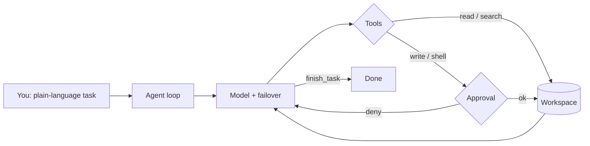

<h1 align="center">⃤ V R I T R A A I ⃤</h1>

<p align="center">
  <strong>Terminal-native AI coding agent for Termux &amp; Linux - pip install, approve diffs, ship</strong>
</p>

<p align="center">
  
  
  
  
  
  <a href="https://vritraai.vritrasec.com/"></a>
</p>

<p align="center">
  <a href="https://vritraai.vritrasec.com/"><strong>Documentation</strong></a> ·
  <a href="https://vritraai.vritrasec.com/docs/getting-started/">Getting started</a> ·
  <a href="https://pypi.org/project/vritraai/">PyPI</a> ·
  <a href="CHANGELOG.md">Changelog</a>
</p>

---

> 🎯 **Why VritraAI?** Because chatbots paste snippets and IDEs babysit one file.
> VritraAI runs an **agent loop** in your terminal: read the repo, edit multiple
> files, run shell, verify, and stop when the task is done - with diffs you approve
> first. No server UI. No silent writes.

🧭 **Tool Purpose** - local coding agent for real project work. Free-tier keys
(Gemini / OpenRouter `:free` / Groq) are enough to start. Only approve changes
you understand.

📚 **Full docs:** [https://vritraai.vritrasec.com/](https://vritraai.vritrasec.com/)
(guides, slash commands, providers, approvals, troubleshooting).

---

## 📋 Table of contents

- [📸 Preview](#-preview)
- [✨ Features](#-features)
- [🧠 How it works](#-how-it-works)
- [📦 Installation](#-installation)
- [🚀 Usage](#-usage)
- [🧰 Agent modes](#-agent-modes)
- [⌨️ Slash commands](#️-slash-commands)
- [🔌 Providers](#-providers)
- [📁 Where files go](#-where-files-go)
- [🌍 Environment](#-environment)
- [🩺 Setup check](#-setup-check)
- [📚 Documentation](#-documentation)
- [❓ FAQ](#-faq)
- [🔁 Changelog](#-changelog)
- [⚠️ Disclaimer](#️-disclaimer)
- [📜 License](#-license)

---

## 📸 Preview

<p align="center">
  
</p>

<p align="center"><em>Startup banner - type <code>/</code> for commands · plain text runs the coding agent.</em></p>

```text
vritraai › Scaffold a FastAPI service with /health, pytest, and a short README

· workspace /home/you/demo
· Calling model …
· Create  app/main.py
· Create  tests/test_health.py
· $ python3 -m pytest -q
Done - health route green, README written.
```

---

## ✨ Features

| Feature | ≤0.30.x (shell) | 1.0.0-cli (agent) |
|---|---|---|
| Product model | AI-enhanced interactive shell | ✅ full coding agent |
| Plain-text input | shell / chat | ✅ agent task (no `/` prefix) |
| Multi-step tools | ❌ limited | ✅ read · write · edit · shell · verify · git · todos |
| Multi-file delivery | ❌ manual | ✅ batch writes + exact-match edits |
| Stub rejection | ❌ | ✅ hollow HTML/CSS/JS rejected |
| Multi-provider | partial | ✅ Gemini · OpenRouter · Groq · Mistral · NVIDIA |
| Failover | ❌ | ✅ free-tier routing, skip paid dead-ends |
| Diff approvals | dangerous-cmd only | ✅ ask / auto / safe per workspace |
| Slash utilities | shell helpers | ✅ `/review` `/security` `/optimize` `/refactor` `/doc` `/project` … |
| Streaming UI | varies | ✅ live narration + clean code previews |
| Docs site | shell-era archive | ✅ [vritraai.vritrasec.com](https://vritraai.vritrasec.com/) |

---

## 🧠 How it works



1. You open a folder with `vritraai`.
2. Plain text becomes a **task** - the model calls tools in a loop.
3. Writes and shell hit the **approval gate** (unless trust is `auto`).
4. The agent verifies work, then calls `finish_task` with a summary.

Deep dive: [Agent loop docs](https://vritraai.vritrasec.com/docs/agent/)

---

## 📦 Installation

| System | Supported |
|---|---|
| Termux (Android) | ✅ |
| Linux (any distro) | ✅ |
| macOS | ✅ |

**Requirements:** Python 3.9+ (3.10+ preferred), network for model APIs, at least one provider key. No root.

```bash
pip install vritraai
```

**Termux:**

```bash
pkg install python
pip install -U vritraai
```

No Rust build tools needed - VritraAI does **not** depend on `openai` / `jiter` (those break on Termux). OpenAI-compatible providers use a pure-Python `requests` client.

**From source:**

```bash
git clone https://github.com/MrHacker-X/VritraAI.git
cd VritraAI
python3 -m venv .venv
source .venv/bin/activate
pip install -e .
```

**Single-line:**

```bash
pip install vritraai && vritraai .
```

The package installs the **`vritraai`** console script on your `$PATH`.

Install guide: [vritraai.vritrasec.com/docs/installation/](https://vritraai.vritrasec.com/docs/installation/)

---

## 🚀 Usage

**Interactive:**

```bash
vritraai
vritraai ~/projects/my-app
```

**First session:**

```text
/setup          # add Gemini / OpenRouter / Groq / … keys
/model          # pick gemini-flash-latest or openrouter/free
Build a FastAPI /health service with pytest and a short README
```

1. Choose a permission mode - *ask before changes* (default), *trust this workspace*, or *strict*.
2. Run `/setup` and add at least one key (free Gemini or OpenRouter is enough).
3. Run `/model` - good defaults: `gemini-flash-latest` or `openrouter/free`.
4. Type a real task. No `/` prefix = coding agent.

**More task ideas:**

```text
Add pytest coverage for auth/ and fix whatever fails.
Refactor utils/dates.py to use zoneinfo - keep public API stable.
Scan this repo for common web vulns and open a SECURITY_NOTES.md.
```

**Utilities:**

```bash
vritraai --help
vritraai -h
vritraai --version
vritraai -v
```

Quick start: [vritraai.vritrasec.com/docs/getting-started/](https://vritraai.vritrasec.com/docs/getting-started/)

---

## 🧰 Agent modes

| Mode | What it does | Best for |
|---|---|---|
| `plain text` | multi-step agent loop: tools until `finish_task` | building, fixing, scaffolding |
| `/setup` · `/model` | configure keys and active model | first run, switching providers |
| `/review` · `/security` · `/optimize` · `/refactor` | focused slash utilities | audits without leaving the CLI |
| `/doc` · `/project` | docs generation + project health | readmes, deps, missing pieces |
| approval `ask` | preview every write / shell | default, safest |
| approval `auto` | trust this workspace | trusted local folders |
| approval `safe` | strict for this workspace | unfamiliar trees |

Every write and shell command hits the approval gate unless you chose `auto`.
Failover skips dead model IDs and prefers free-tier routes when paid credits are gone.

Approvals guide: [vritraai.vritrasec.com/docs/approvals/](https://vritraai.vritrasec.com/docs/approvals/)

---

## ⌨️ Slash commands

Type `/` for the autocomplete menu.

| Command | What it does |
|---|---|
| `/setup` | Configure API keys |
| `/model` | Choose the active model |
| `/help` | List commands |
| `/review` | AI code review |
| `/explain` | Explain a command or concept |
| `/security` | Security vulnerability scan |
| `/optimize` | Optimize a source file |
| `/refactor` | Refactor or convert a file |
| `/summarize` | Summarize a file or directory |
| `/learn` | Learn a topic with examples |
| `/cheatsheet` | Quick reference |
| `/doc` | Docs (`docstring` · `readme` · `diagram`) |
| `/project` | `analyze` · `type` · `deps` · `health` · `missing` · `optimize` |
| `/clear` | Clear the screen |
| `/exit` | Quit |

**Aliases:** `/models` → `/model`, `/cheat` → `/cheatsheet`.

Full command reference: [vritraai.vritrasec.com/docs/commands/](https://vritraai.vritrasec.com/docs/commands/)

---

## 🔌 Providers

Configure with `/setup`, pick with `/model`.

| Provider | Get a key | Typical use |
|---|---|---|
| **Gemini** | [aistudio.google.com/apikey](https://aistudio.google.com/apikey) | Default free path - `gemini-flash-latest` |
| **OpenRouter** | [openrouter.ai/keys](https://openrouter.ai/keys) | Broad catalog - prefer `:free` |
| **Groq** | [console.groq.com/keys](https://console.groq.com/keys) | Fast open-weight; strong failover |
| **Mistral** | [console.mistral.ai/api-keys](https://console.mistral.ai/api-keys) | Prefer Codestral for tools |
| **NVIDIA** | [build.nvidia.com](https://build.nvidia.com/) | Optional Integrate API models |

Failover skips dead IDs, avoids burning paid OpenRouter when credits are gone, and keeps other free OpenRouter models after a single 429.

Providers guide: [vritraai.vritrasec.com/docs/providers/](https://vritraai.vritrasec.com/docs/providers/)

---

## 📁 Where files go

```
~/.config-vritrasecz/vritraai/     ← user config (outside any repo)
├── config.json                   ← API keys, model, trust
└── session.log

your-project/                     ← the folder you opened with vritraai
└── .vritraai/
    └── agent_memory.json         ← workspace-scoped agent memory
```

- Keys never live in the git tree - config is under `~/.config-vritrasecz/`.
- `.vritraai/`, `.env`, and local secrets are gitignored.
- Config reference: [vritraai.vritrasec.com/docs/configuration/](https://vritraai.vritrasec.com/docs/configuration/)

---

## 🌍 Environment

| Variable | Purpose |
|---|---|
| `VRITRA_APPROVAL` | `ask` \| `auto` \| `safe` - skip the trust prompt |
| `VRITRA_RESET_TRUST` | `1` - forget cached folder trust |
| `VRITRA_AGENT_MAX_ITER` | Max agent turns (default `32`) |
| `VRITRA_MODEL_TIMEOUT` | Per-model wall-clock seconds (default `120`) |
| `VRITRA_AGENT_STREAM` | `0` to disable streaming narration |

---

## 🩺 Setup check

```bash
vritraai .
# then inside the REPL:
/setup
/model
/help
```

| Check | Meaning |
|---|---|
| Python 3.9+ | runtime |
| `pip install vritraai` | `vritraai` on `$PATH` |
| `/setup` | at least one provider key |
| `/model` | a working free or paid model ID |
| network | model API reachability |
| approval mode | ask / auto / safe for this folder |

Stuck? [Troubleshooting](https://vritraai.vritrasec.com/docs/troubleshooting/)

---

## 📚 Documentation

| Resource | Link |
|---|---|
| **Docs home** | [https://vritraai.vritrasec.com/](https://vritraai.vritrasec.com/) |
| Getting started | [docs/getting-started](https://vritraai.vritrasec.com/docs/getting-started/) |
| Installation | [docs/installation](https://vritraai.vritrasec.com/docs/installation/) |
| Agent loop | [docs/agent](https://vritraai.vritrasec.com/docs/agent/) |
| Tools | [docs/tools](https://vritraai.vritrasec.com/docs/tools/) |
| Approvals | [docs/approvals](https://vritraai.vritrasec.com/docs/approvals/) |
| Providers | [docs/providers](https://vritraai.vritrasec.com/docs/providers/) |
| Slash commands | [docs/commands](https://vritraai.vritrasec.com/docs/commands/) |
| Configuration | [docs/configuration](https://vritraai.vritrasec.com/docs/configuration/) |
| Security | [docs/security](https://vritraai.vritrasec.com/docs/security/) |
| Troubleshooting | [docs/troubleshooting](https://vritraai.vritrasec.com/docs/troubleshooting/) |
| Local docs tree | [`vritraai-docs/`](vritraai-docs/) in this repo |
| Legacy shell docs | [`vritraai-og/`](vritraai-og/) |

Serve the local docs tree:

```bash
cd vritraai-docs && python3 -m http.server 8080
# open http://127.0.0.1:8080/
```

---

## ❓ FAQ

**Do I need a paid API key?**  
No. A free Gemini key or OpenRouter `:free` models are enough; Groq free tier works well as failover.

**Where are my keys stored?**  
`~/.config-vritrasecz/vritraai/config.json` - outside any repository, never committed.

**What happened to the old 0.30.x shell?**  
Previous product line. From `1.0.0-cli` VritraAI is a coding agent - see [CHANGELOG.md](CHANGELOG.md) and [About](https://vritraai.vritrasec.com/about/).

**Can the agent touch files outside my project?**  
It works inside the workspace you open; every write or shell command is gated by your approval mode.

**Where is the full manual?**  
[https://vritraai.vritrasec.com/](https://vritraai.vritrasec.com/)

---

## 🔁 Changelog

**1.0.0-cli - full rewrite** (the upgrade from ≤0.30.x)

| ≤0.30.x | 1.0.0-cli |
|---|---|
| Themeable AI shell / REPL | terminal coding agent |
| Command-centric UX | goal → tools → verify → `finish_task` |
| Limited multi-file work | multi-file writes + exact edits |
| Provider setup varied | unified `/setup` + `/model` |
| No agent failover story | free-tier failover routing |
| Approval = dangerous cmds | diff preview + workspace trust modes |
| Docs for shell era | [vritraai.vritrasec.com](https://vritraai.vritrasec.com/) |

Full history: [CHANGELOG.md](CHANGELOG.md).

---

## ⚠️ Disclaimer

VritraAI can read, write, and run shell commands inside the workspace you open.
You are responsible for the keys you configure, the diffs you approve, and the
commands you allow. Do not point it at folders or credentials you are not
allowed to modify. Treat it as a powerful local tool - review every change.

Security notes: [vritraai.vritrasec.com/docs/security/](https://vritraai.vritrasec.com/docs/security/) · Contact: [contact@vritrasec.com](mailto:contact@vritrasec.com)

---

## 📜 License

Released under the MIT License - see [LICENSE](LICENSE).

MIT © Alex Butler / Vritra Security Organization

---

## 🔗 Links

| | |
|---|---|
| Documentation | [vritraai.vritrasec.com](https://vritraai.vritrasec.com/) |
| PyPI | [pypi.org/project/vritraai](https://pypi.org/project/vritraai/) |
| GitHub | [MrHacker-X/VritraAI](https://github.com/MrHacker-X/VritraAI) |
| Issues | [Issues](https://github.com/MrHacker-X/VritraAI/issues) |
| Website | [vritrasec.com](https://vritrasec.com) |
| Changelog | [CHANGELOG.md](CHANGELOG.md) |
